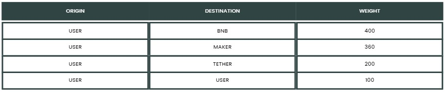
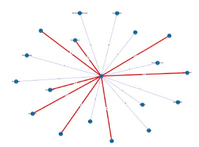

# Blockchain use ego graph 

### Generates a weighted ego graph. The attribute is the frequency of use of each smart contract. 

The dataset needs three columns:
- **Origin**: the wallet sending the funds.
- **Destination**: the smart contract impacted. 
- **Weight**: the number of interactions. 

It will generate an image similar to the following: 

## License 

This source code is licensed under the MIT license, which you can find in the MIT-LICENSE.txt file.

